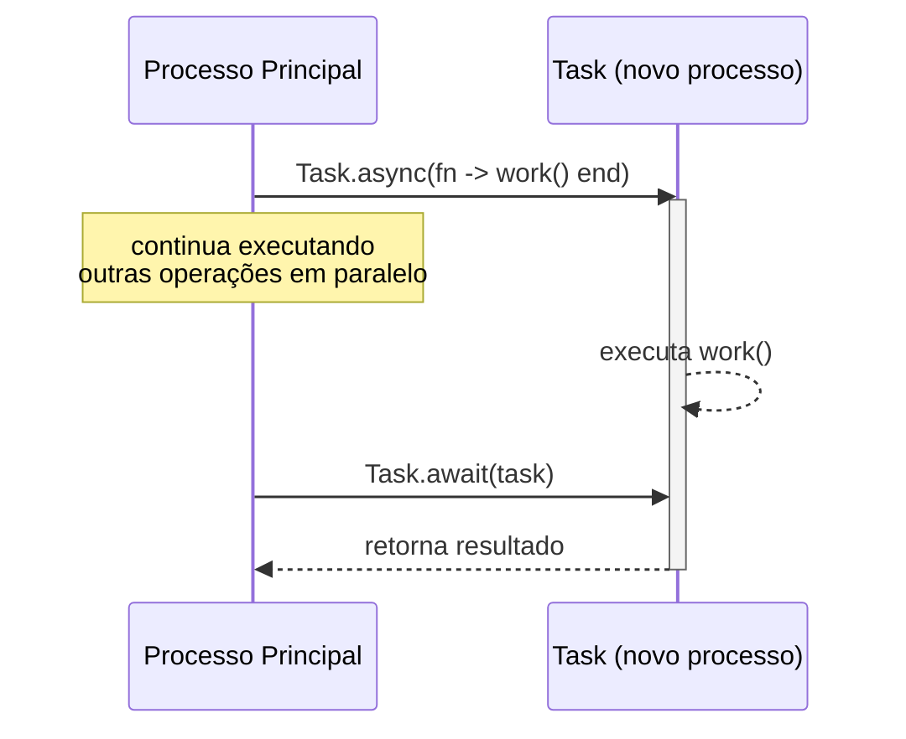
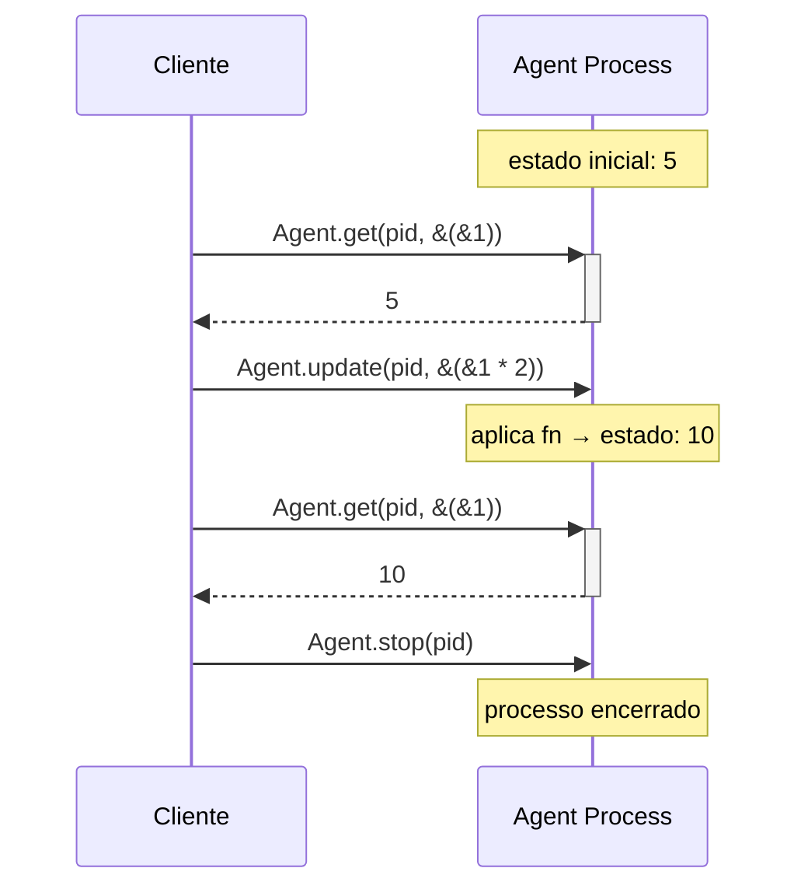
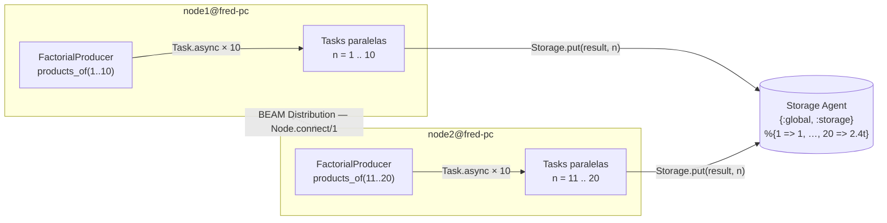
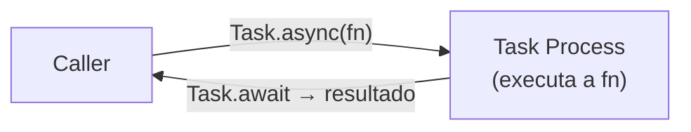
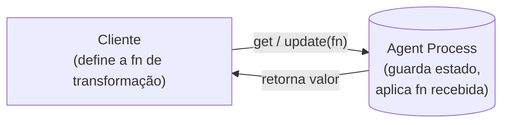
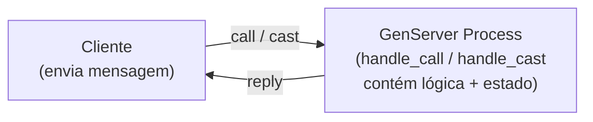

# 08 - Distribution, Tasks and Agents

Distribuição, execução concorrente de tarefas e gerenciamento simplificado de estado com `Agent`.

## Arquivos

| Arquivo | Descrição |
|---------|-----------|
| `01-task.ex` | Exemplo básico de `Task`: executar trabalho assíncrono e aguardar o resultado |
| `02-agent.ex` | Exemplo básico de `Agent`: iniciar, ler e atualizar estado |
| `03-storage.ex` | Exemplo distribuído combinando `Agent` (estado global) e `Task` (cálculo paralelo de fatoriais) |

---

## Task

`Task` é uma abstração sobre processos para executar trabalho concorrente e recuperar o resultado de forma simples.

### Exemplo básico (`01-task.ex`)

```elixir
worker = Task.async(fn -> Demo.work() end)
IO.puts("Doing other work in the main process...")

answer = Task.await(worker)
IO.puts("The answer is: #{inspect(answer)}")
```

### Ciclo de vida de uma Task



> Com `Task.start/1` o processo é disparado e esquecido — não há `await` e o resultado é descartado.

### `Task.start` vs `Task.async`

| Função | Retorna | Resultado recuperável? | Uso típico |
|--------|---------|------------------------|------------|
| `Task.async/1` | `%Task{}` | Sim (via `Task.await`) | Computações paralelas com resultado |
| `Task.start/1` | `{:ok, pid}` | Não | Side effects sem resultado |

### Task.async_stream

Quando o trabalho é processar uma **coleção inteira em paralelo**, `Task.async_stream` é mais ergonômico do que criar tasks manualmente — é exatamente o que `FactorialProducer.products_of/1` faz internamente:

```elixir
# forma manual (usada no 03-storage.ex)
numbers
|> Stream.map(fn n -> Task.async(fn -> work(n) end) end)
|> Enum.map(&Task.await/1)

# forma idiomática com async_stream
numbers
|> Task.async_stream(&work/1, max_concurrency: 4, timeout: 5000)
|> Enum.map(fn {:ok, result} -> result end)
```

---

## Agent

`Agent` é um GenServer simplificado para gerenciar estado. Útil quando a lógica de negócio está no cliente e o processo só precisa guardar um valor.

### Exemplo básico (`02-agent.ex`)

```elixir
{:ok, pid} = Agent.start(fn -> 5 end)

Agent.get(pid, fn state -> state end) |> IO.puts     # 5

Agent.update(pid, &(&1 * 2))
Agent.get(pid, &(&1)) |> IO.puts                     # 10
```

### Como o Agent funciona internamente



> A função passada para `get`/`update` é **executada dentro do processo Agent**, não no cliente. Por isso o Agent pode ser acessado concorrentemente sem condições de corrida.

### API principal

```elixir
# Iniciar com nome registrado
{:ok, agent} = Agent.start_link(fn -> 0 end, name: :counter)

# Ler estado
Agent.get(:counter, fn state -> state end)            # 0

# Atualizar estado
Agent.update(:counter, fn state -> state + 1 end)

# Ler e atualizar atomicamente
Agent.get_and_update(:counter, fn state -> {state, state + 1} end)

# Parar
Agent.stop(:counter)
```

---

## Distribuição

Elixir roda sobre a BEAM, que suporta clusters de nós Erlang nativamente. Processos em nós diferentes se comunicam da mesma forma que processos locais.

### Arquitetura do exemplo distribuído



> Cada nó cria suas tasks localmente, mas `Storage.put/2` chama o Agent pelo nome global `{:global, :storage}`. A BEAM roteia a mensagem automaticamente para o nó onde o Agent foi iniciado (node1), sem nenhuma configuração extra.

### Exemplo distribuído: Fatoriais em paralelo (`03-storage.ex`)

O arquivo `03-storage.ex` define dois módulos:

- **`Storage`** — Agent com nome global (`{:global, :storage}`), acessível por qualquer nó do cluster. Armazena os resultados dos fatoriais em um `Map`.
- **`FactorialProducer`** — Usa `Task.async` para calcular fatoriais em paralelo e salva cada resultado no `Storage` distribuído.

```elixir
defmodule Storage do
  @name {:global, :storage}

  def start_link, do: Agent.start_link(fn -> %{} end, name: @name)
  def put(result, number), do: Agent.update(@name, &Map.merge(&1, %{number => result}))
  def factorials, do: Agent.get(@name, & &1)
  def factorial_of(number), do: Agent.get(@name, & &1[number])
end

defmodule FactorialProducer do
  def products_of(numbers) do
    numbers
    |> Stream.map(fn number -> Task.async(fn -> factorial(number) end) end)
    |> Enum.map(&Task.await/1)
  end

  def factorial(number) do
    do_factorial(1, number) |> Storage.put(number)
  end

  defp do_factorial(result, 0), do: result
  defp do_factorial(result, n), do: do_factorial(result * n, n - 1)
end
```

### Executando em dois nós

> **Atenção:** inicie os dois terminais antes de executar `Node.connect`. Se o nó de destino ainda não estiver no ar, o retorno será `false` e a conexão não será estabelecida.

Abra dois terminais e carregue o mesmo arquivo em cada nó:

**Terminal 1 — node1**

```bash
iex --sname node1 03-storage.ex
```

```elixir
iex(node1@fred-pc)1> Node.connect :"node2@fred-pc"
true
iex(node1@fred-pc)2> Storage.start_link
{:ok, #PID<0.126.0>}
iex(node1@fred-pc)3> Node.list
[:"node2@fred-pc"]
iex(node1@fred-pc)4> FactorialProducer.products_of 1..10
[:ok, :ok, :ok, :ok, :ok, :ok, :ok, :ok, :ok, :ok]
iex(node1@fred-pc)5> Storage.factorials()
%{
  1 => 1,
  2 => 2,
  3 => 6,
  4 => 24,
  5 => 120,
  6 => 720,
  7 => 5040,
  8 => 40320,
  9 => 362880,
  10 => 3628800,
  ...
}
```

**Terminal 2 — node2**

```bash
iex --sname node2 03-storage.ex
```

```elixir
iex(node2@fred-pc)1> Node.connect :"node1@fred-pc"
true
iex(node2@fred-pc)2> Node.list
[:"node1@fred-pc"]
iex(node2@fred-pc)3> FactorialProducer.products_of 11..20
[:ok, :ok, :ok, :ok, :ok, :ok, :ok, :ok, :ok, :ok]
iex(node2@fred-pc)4> Storage.factorials()
%{
  1 => 1,
  2 => 2,
  3 => 6,  
  4 => 24,
  5 => 120,
  6 => 720,
  7 => 5040,
  8 => 40320,
  9 => 362880,
  10 => 3628800,
  11 => 39916800,
  12 => 479001600,
  13 => 6227020800,
  14 => 87178291200,
  15 => 1307674368000,
  16 => 20922789888000,
  17 => 355687428096000,
  18 => 6402373705728000,
  19 => 121645100408832000,
  20 => 2432902008176640000
}
```

> Cada nó calculou sua faixa de fatoriais com `Task.async` e salvou os resultados no `Storage` global. Como o Agent usa `{:global, :storage}`, ambos os nós enxergam e atualizam o mesmo estado compartilhado.

### Conectando nós

```elixir
Node.connect(:"node2@hostname")   # conecta ao nó remoto
Node.list()                        # lista nós conectados
Node.self()                        # nome do nó atual
```

### Considerações

- Nomes curtos (`--sname`) funcionam na mesma máquina; use `--name` para redes diferentes
- Todos os nós devem compartilhar o mesmo **cookie** (`--cookie`) para se conectar — quando omitido, o cookie padrão da BEAM é usado
- A distribuição usa TCP: firewall pode bloquear as portas EPMD (4369) e as portas de nó
- O Agent registrado com `{:global, :name}` fica visível em todo o cluster automaticamente

---

## Comparação: Task × Agent × GenServer

**Task** — trabalho concorrente pontual



**Agent** — estado simples, lógica no cliente



**GenServer** — lógica e estado no servidor



| | `Task` | `Agent` | `GenServer` |
|---|--------|---------|-------------|
| **Propósito** | Trabalho assíncrono com resultado | Estado compartilhado simples | Processo com comportamento próprio |
| **Onde vive a lógica** | No caller | No cliente (fn passada) | No servidor (callbacks) |
| **Estado persistente** | Não | Sim | Sim |
| **Resultado recuperável** | Sim (`await`) | Sim (`get`) | Sim (`call`) |
| **Complexidade** | Baixa | Baixa | Alta |
| **Uso típico** | Paralelismo, I/O concorrente | Contador, cache, acumulador | Servidor com regras de negócio |
