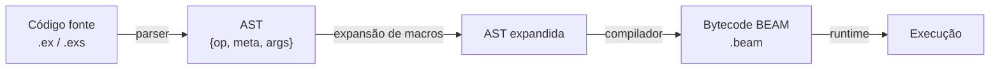
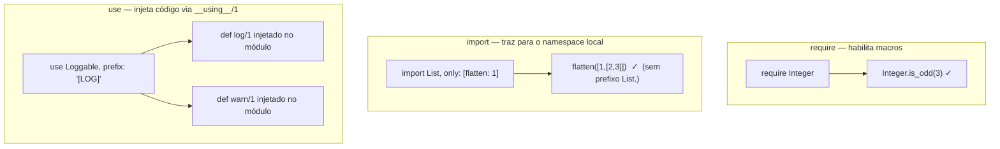
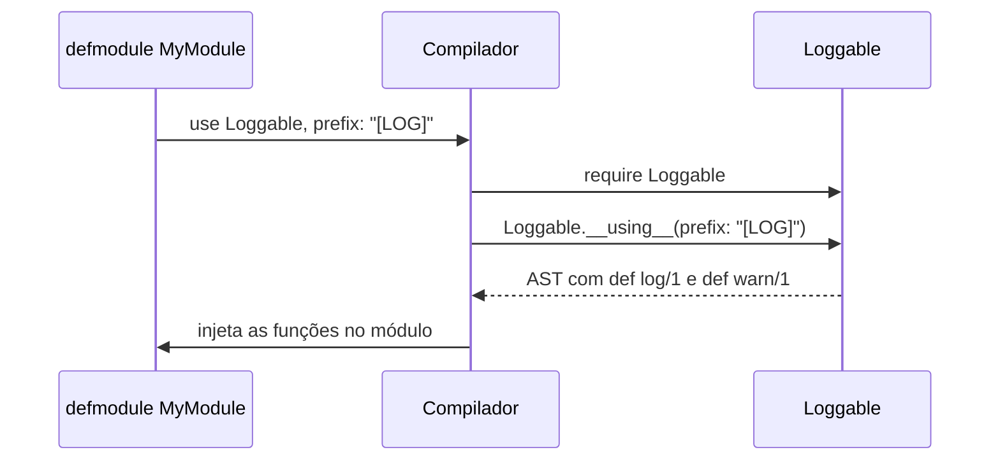
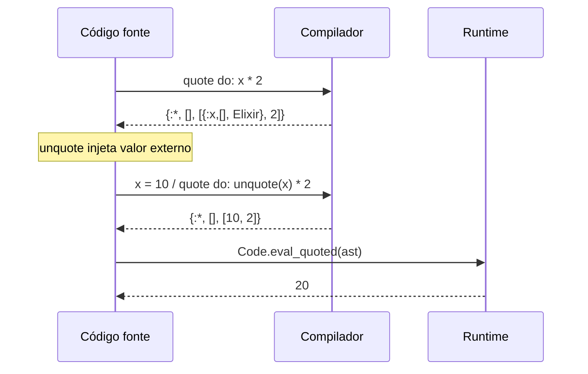
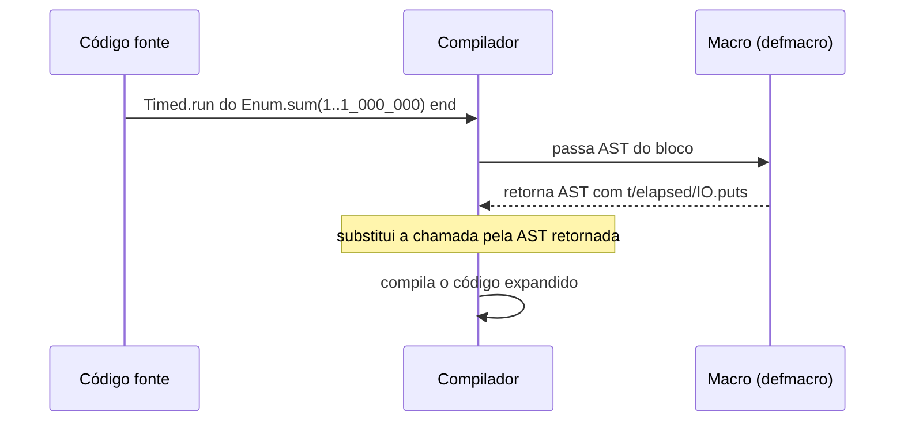
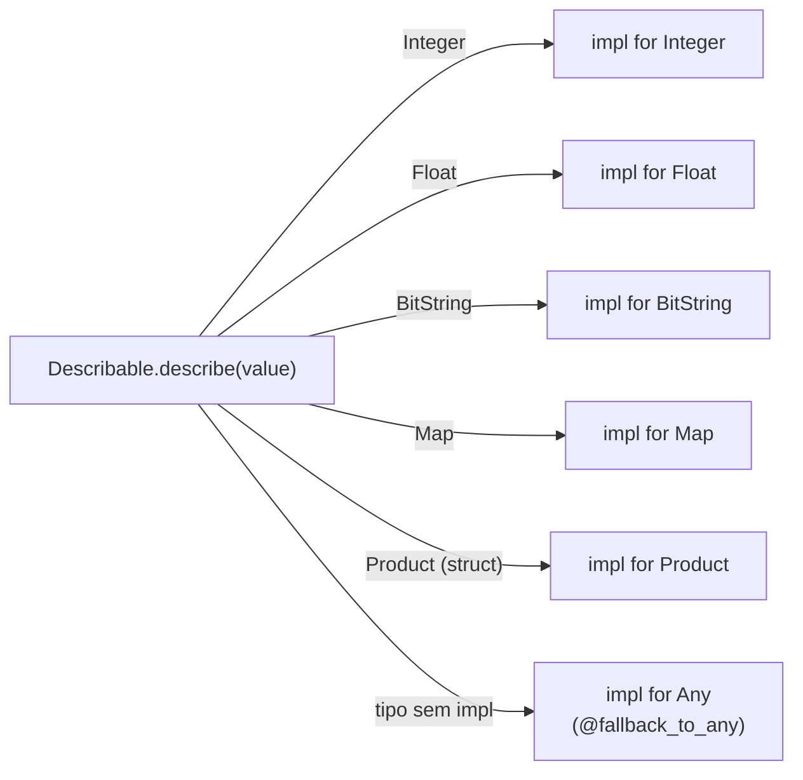

# 09 - Metaprogramming

Metaprogramação em Elixir é escrever **código que gera código** em tempo de compilação. O Elixir expõe sua própria AST como estruturas de dados nativas, tornando macros cidadãos de primeira classe na linguagem.

## Arquivos

| Arquivo | O que cobre |
|---------|-------------|
| `01-require_import_use.exs` | Os três mecanismos de importação de código: `require`, `import`, `use` |
| `02-quote_unquote.exs` | Captura e manipulação da AST com `quote`, `unquote`, `Code.eval_quoted` |
| `03-macros.exs` | 6 passos progressivos: `say_hello`, `greet`, `show_ast`, `Dbg.inspect`, `Timed.run`, geração com `for` |
| `04-protocol.exs` | Polimorfismo por tipo com `defprotocol` e `defimpl` |

## Como rodar

```bash
cd 09-metaprogramming

elixir 01-require_import_use.exs
elixir 02-quote_unquote.exs
elixir 03-macros.exs
elixir 04-protocol.exs
```

---

## Pipeline de compilação



> Macros atuam na etapa de **expansão** — transformam AST em outra AST antes de o compilador gerar bytecode. Funções normais não têm acesso a essa etapa.

---

## require, import e use

### O que cada um faz



| | `require` | `import` | `use` |
|--|-----------|----------|-------|
| O que faz | Carrega macros | Traz funções/macros sem prefixo | Injeta código via `__using__/1` |
| Escopo | Módulo/função | Módulo/função | Módulo |
| Poder | Baixo | Médio | Alto |
| Exemplo stdlib | `require Integer` | `import Enum, only: [map: 2]` | `use GenServer` |

### Como `use` funciona por baixo



---

## AST — Abstract Syntax Tree

Todo código Elixir é uma tupla `{operador, metadados, argumentos}`:

```elixir
quote do: 1 + 2
# {:+, [context: Elixir, imports: [{2, Kernel}]], [1, 2]}
#   ^op   ^meta                                    ^args

quote do: String.upcase("hello")
# {{:., [], [{:__aliases__, [], [:String]}, :upcase]}, [], ["hello"]}
```

Literais são sua própria AST (números, strings, atoms, listas, tuplas de 2 elementos).

### Fluxo de quote e unquote



---

## defmacro

Macros recebem AST e devolvem AST. A chamada é substituída pela AST retornada **antes** de compilar.

### Ciclo de expansão



### Padrões comuns

**1. Macro simples com argumento**
```elixir
defmodule M2 do
  defmacro greet(name) do
    quote do
      IO.puts("Olá, #{unquote(name)}!")
    end
  end
end
```

**2. Macro recebe AST, não valor**
```elixir
defmodule Dbg do
  defmacro inspect(expr) do
    source = Macro.to_string(expr)   # só possível porque é macro

    quote do
      result = unquote(expr)
      IO.puts("#{unquote(source)} => #{Kernel.inspect(result)}")
      result
    end
  end
end
```

**3. Macro com bloco `do:`**
```elixir
defmodule Timed do
  defmacro run(do: block) do
    quote do
      t      = System.monotonic_time(:millisecond)
      result = unquote(block)
      IO.puts("#{System.monotonic_time(:millisecond) - t}ms")
      result
    end
  end
end
```

**4. Geração de funções em tempo de compilação**
```elixir
defmodule Validators do
  for type <- [:string, :integer, :float, :boolean] do
    def unquote(:"is_#{type}?")(value) do
      case unquote(type) do
        :string  -> is_binary(value)
        :integer -> is_integer(value)
        :float   -> is_float(value)
        :boolean -> is_boolean(value)
      end
    end
  end
end

Validators.is_string?("hello")   # true
Validators.is_integer?(42)       # true
```
> O `for` roda em tempo de compilação e gera uma cláusula por iteração.

### def vs defmacro

| | `def` | `defmacro` |
|--|-------|------------|
| Executado | Runtime | Tempo de compilação |
| Recebe | Valores avaliados | AST (código não executado) |
| Retorna | Qualquer valor | AST que substitui a chamada |
| Quando usar | Sempre que possível | Só quando necessário manipular código |

---

## Protocol

Polimorfismo baseado em **tipo do dado** — a implementação certa é despachada automaticamente.

### Como o despacho funciona



### Estrutura

```elixir
# Definição — a "interface"
defprotocol Describable do
  def describe(value)
end

# Implementações para tipos built-in
defimpl Describable, for: Integer do
  def describe(n), do: "inteiro: #{n}"
end

defimpl Describable, for: BitString do
  def describe(s), do: "string(#{String.length(s)}): \"#{s}\""
end

# Struct customizada — sem alterar o Protocol original
defimpl Describable, for: Product do
  def describe(%Product{name: n, price: p}), do: "produto: #{n} por R$ #{p}"
end

# Fallback para tipos sem implementação específica
defprotocol Printable do
  @fallback_to_any true
  def print(value)
end

defimpl Printable, for: Any do
  def print(value), do: IO.puts("[Any] #{inspect(value)}")
end
```

### Protocol vs Behaviour

| | `Protocol` | `Behaviour` |
|--|------------|-------------|
| Despacho por | Tipo do dado (automático) | Módulo (explícito) |
| Pergunta | *Como este tipo se comporta?* | *Qual módulo implementa esta interface?* |
| Extensível por terceiros | Sim | Sim (mas menos comum) |
| Usado na stdlib | `Enumerable`, `Inspect`, `String.Chars` | `GenServer`, `Supervisor`, `Plug` |

---

## Boas práticas

- Prefira funções quando possível; macros só quando precisar manipular código em compilação
- Use `Macro.to_string/1` e `IO.inspect(quote do: ...)` para inspecionar ASTs
- Documente o que cada macro injeta no módulo chamador
- Em scripts `.exs`, coloque `require` dentro de um `defmodule`, não no top-level

