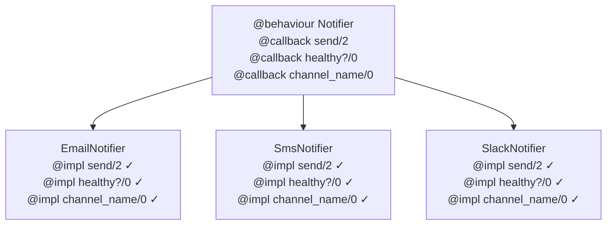
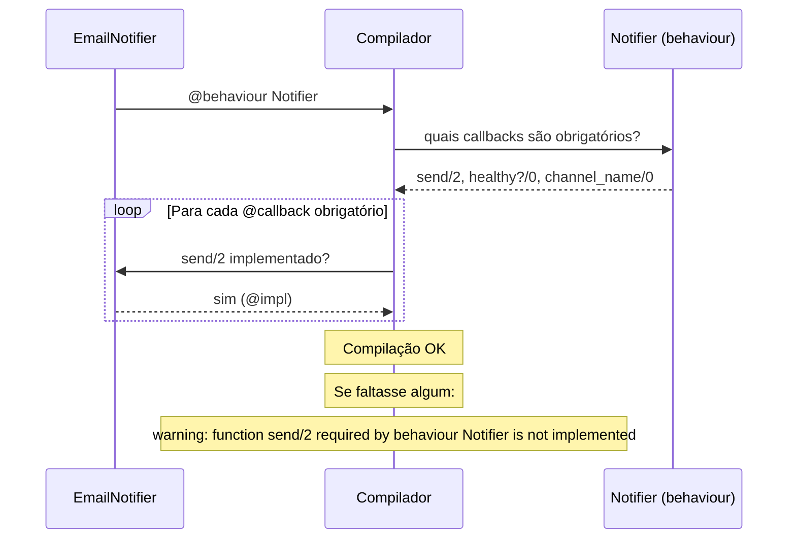
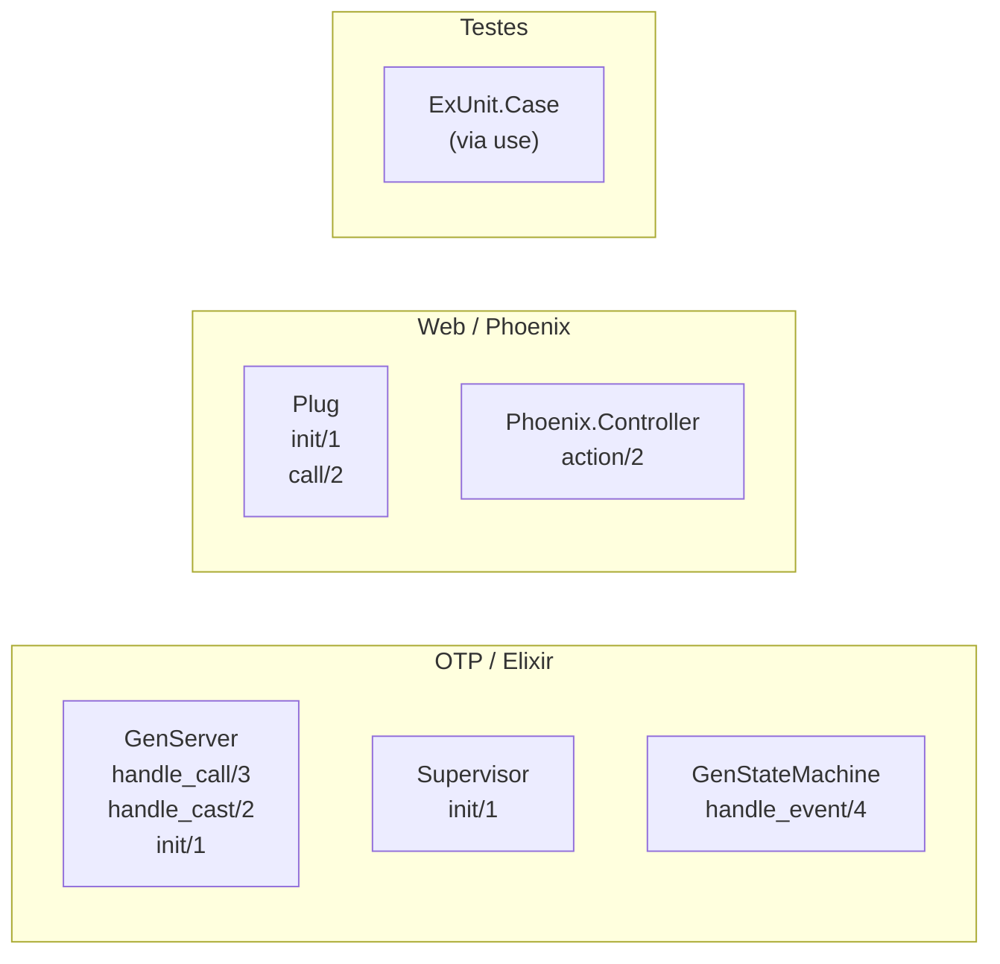
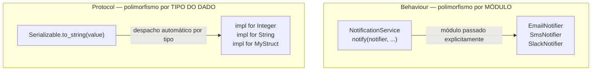

# 10 - Behaviour

`Behaviour` define um **contrato** que um módulo deve implementar — um conjunto de `@callback` obrigatórios verificados pelo compilador em tempo de compilação.

É o mecanismo por trás de `GenServer`, `Supervisor`, `Plug`, `Phoenix.Controller` e praticamente toda abstração extensível do ecossistema Elixir/Erlang.

## Arquivos

| Arquivo | O que cobre |
|---------|-------------|
| `behaviour.exs` | Definindo `@callback`, implementando com `@impl`, polimorfismo via módulo, `@optional_callbacks`, GenServer como exemplo real |

## Como rodar

```bash
cd 10-behaviour
elixir behaviour.exs
```

---

## O que é um Behaviour

Um Behaviour é um módulo que declara funções que **outros módulos devem implementar**. Pense como uma interface em linguagens OO — mas verificada em tempo de compilação, não runtime.



> Se um módulo declara `@behaviour Notifier` mas não implementa `send/2`, o **compilador emite um warning** (e pode ser configurado como erro).

---

## Estrutura

### 1. Definindo o Behaviour

```elixir
defmodule Notifier do
  @callback send(recipient :: String.t(), message :: String.t()) ::
              {:ok, String.t()} | {:error, String.t()}

  @callback healthy?() :: boolean()

  @callback channel_name() :: String.t()

  # Callbacks opcionais — sem warning se não implementados
  @optional_callbacks [schedule: 3]
  @callback schedule(recipient :: String.t(), message :: String.t(), at :: DateTime.t()) ::
              {:ok, String.t()} | {:error, String.t()}
end
```

### 2. Implementando

```elixir
defmodule EmailNotifier do
  @behaviour Notifier   # declara o contrato

  @impl Notifier        # marca explicitamente cada implementação
  def send(recipient, message) do
    # ...
    {:ok, "email_#{id}"}
  end

  @impl Notifier
  def healthy?, do: true

  @impl Notifier
  def channel_name, do: "Email"
end
```

### 3. Usando polimorfismo via módulo

```elixir
defmodule NotificationService do
  def notify(notifier, recipient, message) do
    if notifier.healthy?() do
      case notifier.send(recipient, message) do
        {:ok, id}        -> IO.puts("  ✓ [#{notifier.channel_name()}] ID: #{id}")
        {:error, reason} -> IO.puts("  ✗ [#{notifier.channel_name()}] #{reason}")
      end
    else
      IO.puts("  ✗ [#{notifier.channel_name()}] Canal indisponível")
    end
  end
end

# O caller escolhe qual módulo usar:
NotificationService.notify(EmailNotifier, "fred@example.com", "Olá!")
NotificationService.notify(SmsNotifier,  "+5511999999999",   "Código: 1234")
NotificationService.notify(SlackNotifier, "alerts", "Deploy conclufdo")
```

---

## Ciclo de verificação do compilador



---

## @impl — por que usar?

`@impl` é opcional, mas fortemente recomendado:

| Sem `@impl` | Com `@impl` |
|-------------|-------------|
| Compilador não verifica assinatura | Compilador avisa se assinatura errada |
| Difícil distinguir API pública de callbacks | Intenção fica explícita na leitura |
| Silencioso se @callback não existir | Avisa se a função não é um callback declarado |

```elixir
# @impl pega erros de assinatura:
@impl Notifier
def send(recipient, message, extra) do   # aridade errada → warning imediato
  ...
end
```

---

## Behaviours da stdlib

Os principais behaviours que você vai usar e implementar:



### GenServer é um Behaviour

```elixir
defmodule Counter do
  use GenServer   # injeta @behaviour GenServer + implementações padrão

  @impl GenServer
  def init(initial), do: {:ok, initial}

  @impl GenServer
  def handle_call(:get, _from, state),       do: {:reply, state, state}
  def handle_call(:increment, _from, state), do: {:reply, state + 1, state + 1}

  @impl GenServer
  def handle_cast(:reset, _state), do: {:noreply, 0}

  def start_link(initial \\ 0), do: GenServer.start_link(__MODULE__, initial)
  def get(pid),                  do: GenServer.call(pid, :get)
  def increment(pid),            do: GenServer.call(pid, :increment)
  def reset(pid),                do: GenServer.cast(pid, :reset)
end
```

---

## Behaviour vs Protocol

Ambos são mecanismos de polimorfismo, mas respondem perguntas diferentes:



| | `Behaviour` | `Protocol` |
|--|-------------|------------|
| Despacho por | Módulo (passado explicitamente) | Tipo do dado (automático) |
| Pergunta que responde | *Qual módulo implementa esta interface?* | *Como este tipo se comporta aqui?* |
| Verificação | Compilador (warnings por @callback) | Runtime (erro se não implementado) |
| Extensível por terceiros | Sim | Sim |
| Usado na stdlib | `GenServer`, `Supervisor`, `Plug` | `Enumerable`, `Inspect`, `String.Chars` |
| Quando usar | Módulos intercambiáveis (strategies, adapters) | Funções genéricas sobre múltiplos tipos |

---

## Quando usar cada um

**Use Behaviour quando:**
- Você tem módulos alternativos que seguem a mesma API (ex: adaptadores de banco, canais de notificação)
- Quer que o compilador garanta que todos os módulos implementem o contrato
- O polimorfismo é sobre *quem faz* (módulo), não *o que é* (tipo)

**Use Protocol quando:**
- A mesma função precisa funcionar para tipos diferentes (inclusive tipos de terceiros)
- O polimorfismo é sobre o *tipo do dado*, não sobre qual módulo usar
- Você quer que terceiros possam estender o comportamento para seus próprios tipos
